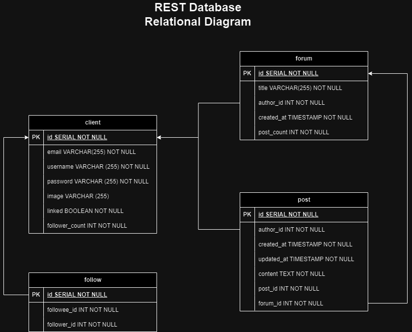

# IF3110 Tugas Besar 2 WBD_REST

## *Tubes2_Kelompok 8_REST*

## **Table of Contents**
* [Program Description](#program-description)
* [Required Program](#required-program)
* [Used Packages](#used-packages)
* [Database Schema](#database-schema)
* [Endpoints](#endpoints)
* [Execution Guide](#execution-guide)
* [Workload Distribution](#workload-distribution)

## **Program Description**
REST protocol based Web Service that provides the service for Web Method for **InfoAnimeMasseForum** app. This REST protocol is used to store and handle user interaction with the system in order to have a forum discussion in the website.

## **Required Program**
Here are the requirements to run the program
| Requirements | Reference Link | Additional Description |
|--------------|----------------|--------------------------|
| NodeJS      |   | `npm i --save-dev @types/node` |
| ExpressJS   |   |  |
| Docker | [Docker](https://docs.docker.com/desktop/install/windows-install/) |  |


## **Used Packages**
Here are the packages used in the program
| Packages | Reference Link | Additional Description |
|----------|------------------------|----|
| nodemon | [nodemon](https://www.npmjs.com/package//nodemon) | `npm install --save-dev nodemon` |
| dotenv  | [dotenv](https://www.npmjs.com/package/dotenv)  | |
| pg    | [pg](https://www.npmjs.com/package/pg)| `npm i --save-dev @types/pg` |
| axios | [axios](https://www.npmjs.com/package/axios) | `npm install axios` |
| easy-soap-request | [easy-soap-request](https://www.npmjs.com/package/easy-soap-request)  | `npm install easy-soap-request` |
| xml-js | [xml-js](https://www.npmjs.com/package/xml-js) | `npm install --save xml-js` |

## **Database Schema**



## **Endpoints**

| Aspect     | HTTP Methods | Endpoints           | Description |
|------------|--------------|---------------------|-------------|
| **Client** |  GET         | /client             | To get all user data|
|            |  GET         | /client/user        | To get current user data |
|            |  GET         | /client/other/:id   | To get a specific data of other user |
|            |  GET         | /client/check       | To check user's authentication of their token |
|            | POST         | /client/token       | To do user authentication to get token when user signup |
|            | POST         | /client             | To insert a new user data |
|            | PUT          | /client             | To update a new data |
| **Follow** | GET          | /follow/:followeeId | To get check a following status of two user |
|            | GET          | /followers          | To get all the followers of current user |
|            | GET          | /followees          | To get all the followees of current user |
|            | POST         | /follow/:followeeId | To establish a new following status |
|            | DELETE       | /follow/:followeeId | To delete a following status |
| **Forum**  | GET          | /forum              | To get all forum data |
|            | GET          | /forum/:id          | To get the data of a specific forum |
|            | POST         | /forum              | To insert the data of a new forum |
|            | POST         | /forum/filter       | To send filtering search of forum |
|            | DELETE       | /forum/:id          | To delete a specific forum |
| **Post**   | GET          | /post               | To get all the post of the current user |
|            | GET          | /post/:id           | To get a specific post data |
|            | GET          | /post/forum/:id     | To get all posts in a specific forum |
|            | POST         | /post               | To insert a new post |
|            | PUT          | /post/:id           | To edit a specific post data |
|            | DELETE       | /post/:id           | To delete a specific post data |
| **SOAP**   | GET          | /soap               | To get reference data of current user |
|            | POST         | /soap               | To insert a new link establishment |
|            | PUT          | /soap               | To unlink current user from reference data |


## **Execution Guide**
1. Clone this repository using the following command
```
https://gitlab.informatika.org/if3110-2023-01-08/if3110-tugas-besar-2-wbd_rest.git
```
2. Move into the directory folder
3. Run the docker using following command
```
docker-compose up --build
```
4. Server could be accessed using browser in URL `http://localhost:3000/api`.


## **Workload Distribution**
| Name                     | Student ID | Functionality | 
|--------------------------|------------|-------------|
| Irfan                    | 10023176   |  |
| Bagas Aryo Seto          | 13521081   | <ul> <li> Client, Follow, Forum, Post Controller <li> Client, Follow, Forum, Post Models <li> Client, Followm Forum, Post Routes <li> Data, JWT config <li> Middleware </ul> |
| Juan Christopher Santoso | 13521116   | <ul> <li> Database setup, connection, function, and triggers <li> Dockerize <li> Database seeding <li> Soap connection <li> Database setup <li> PHP Controller <li> Soap Controller <li> Adjusting Models <li> Soap Route </ul> |
