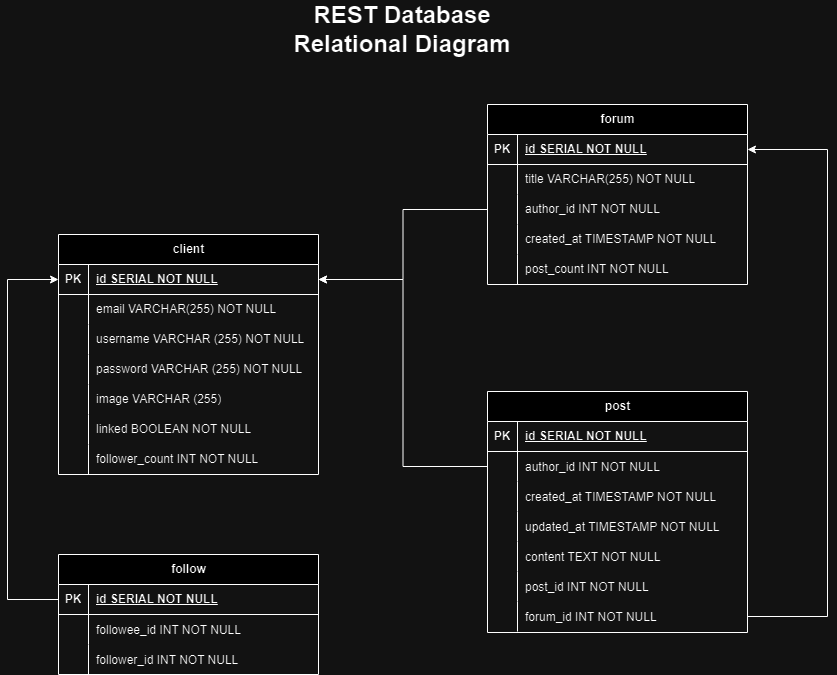

# IF3110 Tugas Besar 2 WBD_REST

## *Tubes1_Kelompok 8*

## **Table of Contents**
* [Program Description](#program-description)
* [Required Program](#required-program)
* [Used Packages](#used-packages)
* [Installation Guide](#installation-guide)
* [Execution Guide](#execution-guide)
* [Progress Report](#progress-report)
* [Workload Distribution](#workload-distribution)

## **Program Description**
REST protocol based Web Service that provides the service for Web Method for **InfoAnimeMasse** app.

## **Program Requirement**
Here are the requirements to run the program
| Requirements | Reference Link | Additional Description |
|--------------|----------------|--------------------------|
| NodeJS      |   | `npm i --save-dev @types/node` |
| ExpressJS   |   |  |
| Docker | [Docker](https://docs.docker.com/desktop/install/windows-install/) |  |


## **Used Packages**
Here are the packages used in the program
| Packages | Reference Link | Additional Description |
|----------|------------------------|----|
| nodemon | [nodemon](https://www.npmjs.com/package//nodemon) | `npm install --save-dev nodemon` |
| dotenv  | [dotenv](https://www.npmjs.com/package/dotenv)  | |
| pg    | [pg](https://www.npmjs.com/package/pg)| `npm i --save-dev @types/pg` |
| axios | [axios](https://www.npmjs.com/package/axios) | `npm install axios` |
| easy-soap-request | [easy-soap-request](https://www.npmjs.com/package/easy-soap-request)  | `npm install easy-soap-request` |
| xml-js | [xml-js](https://www.npmjs.com/package/xml-js) | npm install --save xml-js |

## **Installation Guide**

psql -h postgres_wbd_rest -U postgres -d wbd_rest

select event_object_table, trigger_name from information_schema.triggers;

## **Execution Guide**
1. Run `docker-compose up` in REST _directory_ terminal.
```
docker-compose up --build
```
2. Server could be accessed using browser in URL `http://localhost:3000/api`.
3. Server could be shut down using command `docker-compose down` in REST _directory_ terminal.
```
docker-compose down
```

## **Database Schema**


## **Workload Distribution**
| Name                     | Student ID | Fungsionalitas | 
|--------------------------|------------|-------------|
| Irfan                    | 10023176   |  |
| Bagas Aryo Seto          | 13521081   | <ul> <li> SPA REST Implementations <li> Controllers <li> Models <li> Authentification <li> Routing </ul> |
| Juan Christopher Santoso | 13521116   | <ul> <li> SOAP REST Connection <li> Config <li> Database Schema <li> Login & Sign Up <li> Follow </ul> |
